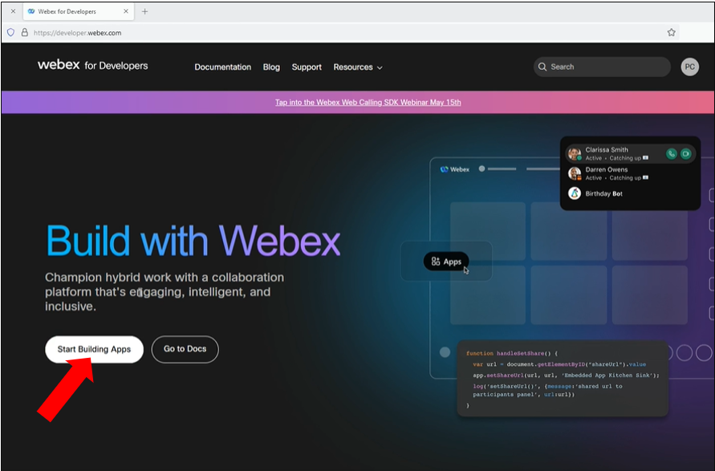
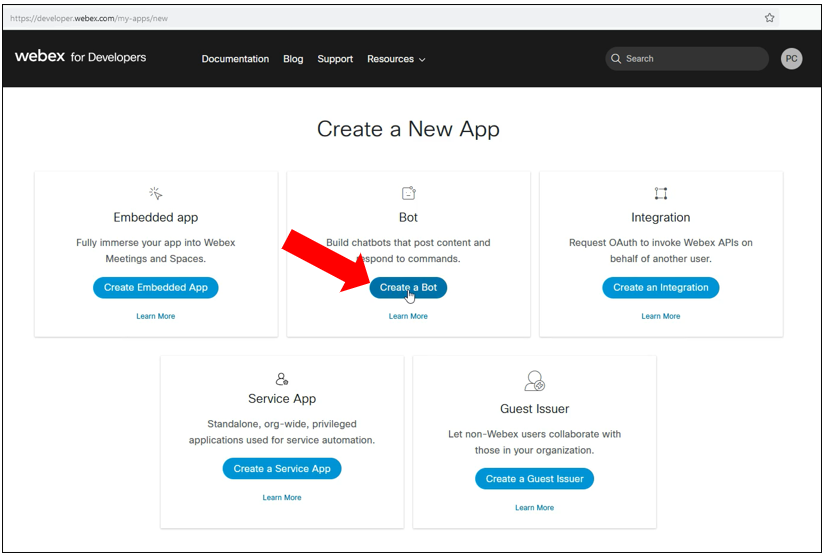
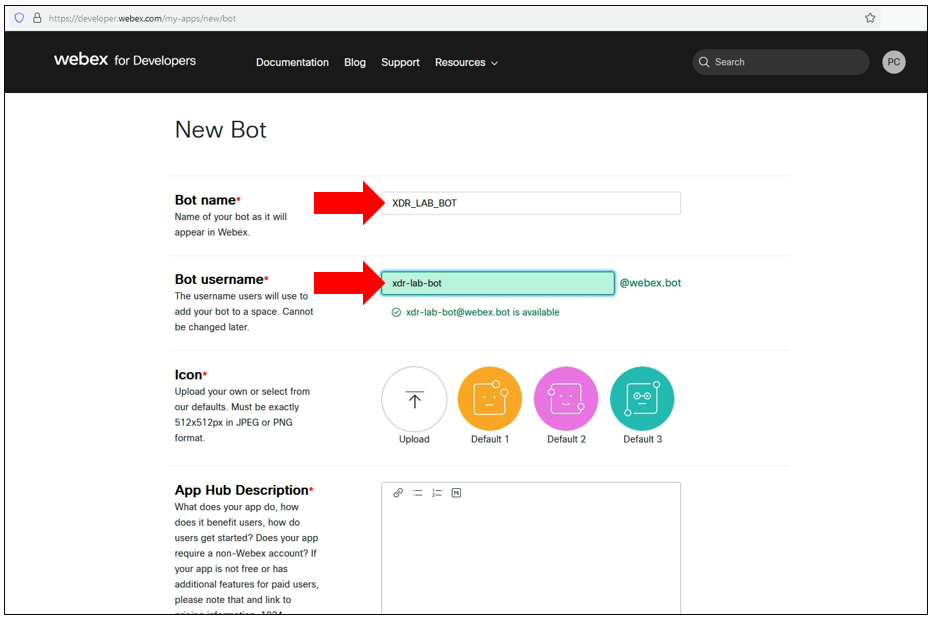
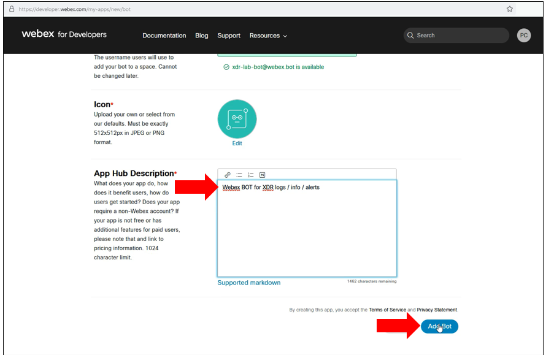
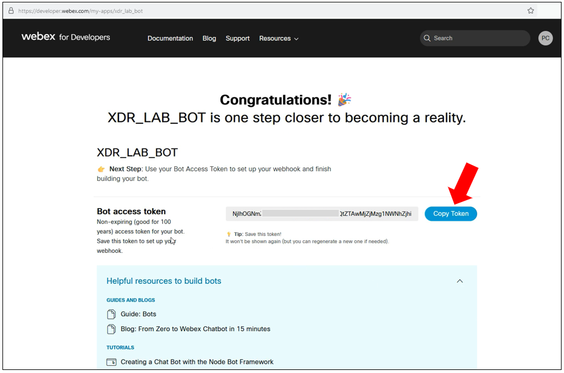
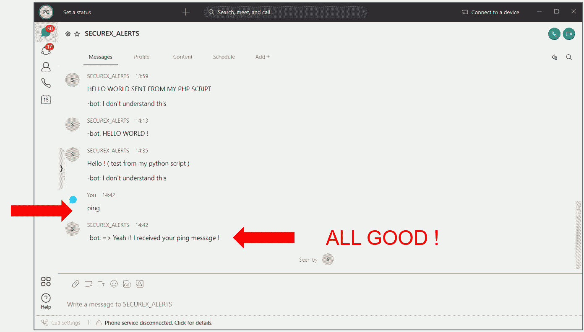
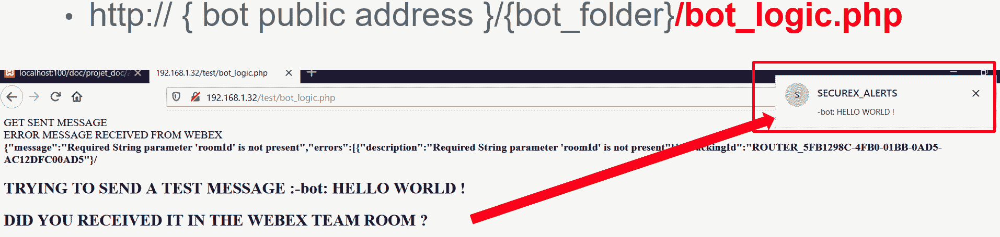
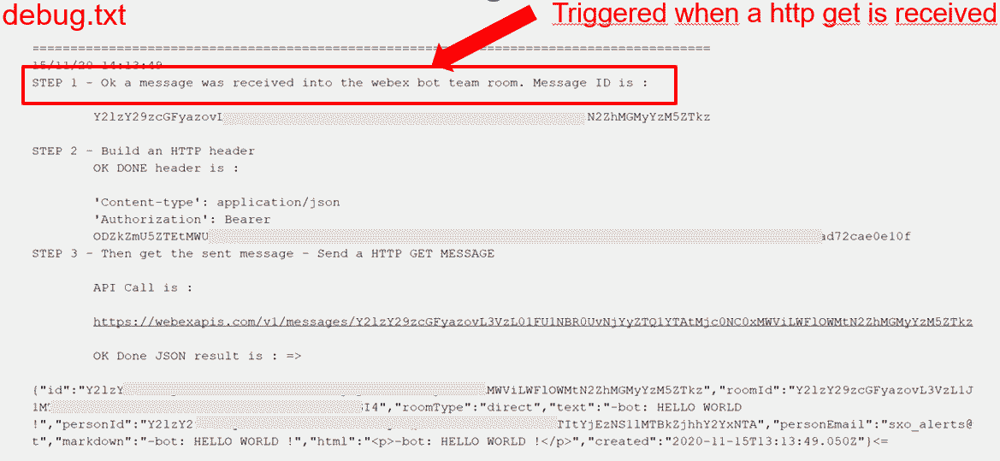

# Introduction

In this repo you will find instructions for :

- Creating a Webex Team Bot and make it send messages to a Destination Webex Team Room
- Adding a Webhook to your Webex Team Bot.
- Create a Pedagogic PHP Web Server Logic for your bot. Which will help you understand step by step how everything works
- Interact with your bot thru it's own Webex Team Room.

# Create a Webex Team Bot

Webex Team Bot are very good interfaces for applications which doesn't have any GUI or output console ( Python scripts or SecureX Workflows for examples ). It is worthit to understand how we could use it in our Networking and Security Applications.

The benefits of using a Webex Team bot is that it will have a permanent Webex Bearer Token. 

Let's create this bot.

Let's go to [Cisco Webex for Developper]('https://developer.webex.com/my-apps')

 

Click on the **start building apps** button and create an new application



Fill all requested fields and create your new bot.




Once created **COPY THE WEBEX BOT TOKEN !!**  and copy it's mail as well.



Then go to your webex team client and create a new space.

**Remark : You don't need to do the following if you want to interact with your Bot. If so you can directly go to the Add some logic to your BOT - Create a webhook section**


Give it a name ( ex PAT_SecureX_ALERTS ) 


Then contact your bot thanks to it's mail, and Add it to the Room.


Retreive the Room ID


Then you can test to send a message from Your Bot the the Webex Team Room.

- Use the BOT Webex Bearer TOKEN.
- Use the destination Room ID
- Send any Test message


## OK YOU ARE GOOD TO GO !!

At this stage you are able to send messages to the Webex Room you just created, from any script or XDR HTTP Request activity.

For doing this you will have to use to the **BOT WEBEX BEARER TOKEN** and the **Webex Team Room ID**.

The **BOT WEBEX BEARER TOKEN** token will never expire which allows us to make XDR use it and then make XDR the Intelligence behind the Webex Room.

The Webex Room becomes a perfect Output interface for XDR workflows. Perfect for receiving any workflow logs or debugs. Perfect for receiving Alerts from XDR and have Security Opertors seing instantly the alerts.

In order to test, You can use the **send_test_message.py** script to send messages to the Webex Team Room, with the Bot Webex Token.

Open the **init_key_and_bot_id.txt** and add into it the Webex Room ID and the BOT Webex Token.

But Better than that above, you can use the Webex Room to send instructions to the Intelligence behind the Room ( aka XDR ), And then use Webex as a GUI for XDR !

To be able to do so, you must connect some logic to your BOT and create a Webex Webhook.

## ( End of Section 1 ) You are done if your goal is just to send Alerts to the Room ( from XDR  for example ). You can stop here

## ( Section 2 ) Continue if your goal is to learn more, and learn how to interact with your BOT ( And trigger actions within XDR )

# Here Under learn about Webex Bot Logic 

## Add some logic to your BOT - Create a webhook

In the previous section the Webex Team Bot act just as a non humain Webex Team client which is able to send messages to a webex Team Room.

But one of the other magic of Webex Team bots is that you can interact directly with them.  You can send them messages and they will answer to you !.

For doing this you need a Webhook.

The Webex Webhook will allow to any web server to receive all the messages which will be sent to the room.

These message will be copied when they will received in the Webex Team Room and sent to the Web server URL.

The Web Server is any web server and the logic inside which can process the sent data by the webhook.

Actually the message is sent thanks to a HTTP **POST** call which act exactly as the calls used to send a formular to a web server.


That means that the web server will act exactly like any web server. It will read the variables sent thru this call and will process them.

The result of the data processing will be an HTTP result containing all the information to be sent as results.

And these results will be sent to the webex team room thanks to Send Message API call to the room ID, with the Webex BOT BEARER TOKEN.

Let's have a look now to how to set up all this.

## The Webhook

Before talking about the bot logic, let's see how to create the webhook which will be used to hook the messages sent to the Webex Team Room

go to :

[Create a Webhook]('https://developer.webex.com/docs/api/v1/webhooks/create-a-webhook')

The **targetURL** must be your Web **Server public URL**

And use Your **Bot Webex BEARER TOKEN**


**resource = messages**

**event = created**

**targetUrl** is the full URL of your bot.Either you have a public Web Server... or not. If not, and for developpment purpose only, consider **NGROK**. NGROK makes Your developpment BOT located into your laptop available on the INTERNET in less than 5 minutes.

**Remark :** the **update_webhook.py** file can help you to automate your bot targetUrl.

[Configure the project to run on your local PC]('https://developer.cisco.com/learning/lab/collab-spark-botkit/step/4')

## The BOT Webex Room

Starting from now, we are going to use the BOT Webex Room Id, in order to interact with it.

Go to your Webex Team and **contact** your bot thanks to it's mail.


And enter to the Bot's room. 
As test, You can send some test messages into the room.  

Nothing will happen until we add the bot logic.

Locate the BOT ROOM ID then. We will use it as the Destination ROOM ID in our logic scripts.

You can use the **list_room.py** to help you to get this room id.

Or in the Webex Developer documentation, use the Webex BOT token to call the **/v1/rooms** api call to get this room id.

## The Bot Logic

Your Web Server Bot is just a Web Server capable to process any HTTP Get request containing variable to process.

You can use any web server and any processing language.

Let's look at this PHP example.

PHP is very simple to understand, and very simple to start.

This is a good the reason to start with it.

The **bot_logic.php** file contained into the **php_bot** subfolder had been design more to be pedagogic than be a production solution.

It comes with a file named **test.php** which will help you to troubleshoot your web server if your bot doesn't work.

## Your bot logic Installation

First we assume that you already have installed a PHP capable web Server. 
Once again, XAMMP is a very good choice. Very easy to install. 

[GET and install XAMPP]('https://www.apachefriends.org/fr/index.html')

Once your PHP web server installed, locate the Web root folder ( **htdocs**) for XAMPP ( apache )

Create a subfolder into it and call it **my_bot** for example.

And copy into it all the file contained into the **php_bot** git subfolder.

Once done, open the **init_key_and_bot_id.txt** file and configure into it the variable values.

**DESTINATION_ROOM_ID:  xxxxxxxxxxxxxxxxxxxxxxxx**

**BOT_ACCESS_TOKEN:  xxxxxxxxxxxxxxxxxxxxxxx**

**Let's test the bot !**

At this point, we can send messages into the Bot.

Go the Bot Webex Room and send **ping** into it.

Now you should receive back the message : **-bot: => Yeah !! I received your ping message !**

## If it doesn't work call the bot_logic.php from your browser

Call the **bot_logic.php** file from your browser and use the Web Server Public IP address.

Here under the expected message :



- If you got some results in your browser, without messages in the webex team room. That means that your web server is reachable by Webex, then check the **TargetUrl** in the webhook.

Open the **debug.txt** file and watch the result.



Here is what does the script.

1 - If a call to the **bot_logic.php** page arrives to the web server, then **STEP 1** is logged into the **debug.txt**. The received call the message ID

2 - Then the script built and send a get call to webex in order to get the message content.

2a - if nothing it received into the initial received call ( test from a browser ). Then the script sends a **Hello World !** message to the Webex Room.  This message should appear into Webex.  If not.  Check the room id and the Webex Bot Token.

3 - The Script should receive back the full sent message embeded into a JSON reply.

4 - The message is extracted

5 - Some if statements are checked. And depending on the messages content, a reply message is built by the script.

6 - last step. If the builted message is not empty, then the script sends it to the Webex Team Room, and that's it.

All these steps should appear into de **debug.txt** file.

## Test your Web Server with the test.php file

If the previous step didn't help call the **test.php** file with the public web server address, should confirm that the Web server is reacheable by Webex and that it can send a message to the webex team room.

The Web Call to this page triggers the reply  

## Test to send a message with a python script

The **send_test_message.py** ran from the web server help to verify that the Web Server is able to send a message to the Webex Team Room.

## Modify action and answers sent by the bot.

This Bot Logiv doesn't do a lot of things.  It just answer to the following messages sent into the Webex Team Room.

- **ping**
- **-hello**
- and a very other things

All this is done into the following section of the code.

```php
if(stripos($messageData,"bot:")==false)
{
	// Define a string we will listen for and do something with
	if(($messageData=="ping")&&(stripos($messageData,"bot:")==false))
	{
		fputs($fd,'		message = ping : We are In the "ping" if branch');
		fputs($fd,"\r\n"); 
		$replied_message="-bot: => Yeah !! I received your ping message !";
		fputs($fd,'		Replied Message will be : "bot: => Yeah !! I received your ping message !"');
		fputs($fd,"\r\n"); 	
	}
	else if((stripos($messageData,"ping")!=false)&&(stripos($messageData,"bot:")!=false))
	{
		$replied_message="-bot: PONG : [ Action for the BOT. An example of hyper link ](http://www.google.com)";
	}
	else if ((stripos($messageData,"hello")!=false)&&(stripos($messageData,"bot:")==false))
	{
		$replied_message="-bot: Hi Man, How are you ?";
	}
	else if ((stripos($messageData,"m fine")!=false)&&(stripos($messageData,"bot:")!=false))
	{
		$replied_message="Perfect !";
	}
	else if ($messageData === "-bot: => I don't understand this")
	{
		$replied_message="";
	}
	else if ($messageData === "")
	{
		$replied_message="-bot: PONG !";
	}
	else if ($messageData === "PONG !")
	{
		$replied_message="";
	}
	else 
	{
		$replied_message="-bot: I don't understand this";
	}
}
else
{	
	fputs($fd,"\r\n"); 	
	fputs($fd,'		This message is an answer from the BOT.  Don\'t process it ');
	fputs($fd,"\r\n"); 	
	fputs($fd,"\r\n"); 	
}
```
The first instruction 

```php
if(stripos($messageData,"bot:")==false)
```

checks if the messages contains the **bot:** string. In order to understand that the message was sent by it self. (and then not process it)

Is the message wes not sent by himself, then we check if the message contents some expected strings.  And if so then specific actions are taken and a reply is sent.

for example look at the following if statement:

```php
if ($messageData === "hello")
	{
		$replied_message="-bot: Hi Man, How are you ?";
	}
```
It check if the message equal "hello"

But look at the following :

```php
if ((stripos($messageData,"hello")
	{
		$replied_message="-bot: Hi Man, How are you ?";
	}
```

This one check if the message contains the string "hello"

**remark :** we dont check if the message contains a command to be executed by the BOT  **- Do Something** or **@bot Do Something**.

You should be able to add this check in the script by your own.

TODO : add a check to verify if the messages starts with the **@** character.

Ok it's up to YOU !!

## What's Next ?

The direction you took is to learn about developping your own Webex Apps for phone. 

In the context of Security, and with XDR ( the intelligence behind Webex ), learn about how to create a Webex based Advanced Alerting system.

First, re do what you learned here with pure python ( PHP was nice and easy for learning. But python will be better for production )

[ Webex Chat Bot Python ](https://github.com/pcardotatgit/Webex_Team_Chat_Bot_Python)

And then jump on :

[ Webex for XDR part 1 ](https://github.com/pcardotatgit/webex_for_xdr_part-1_card_examples)